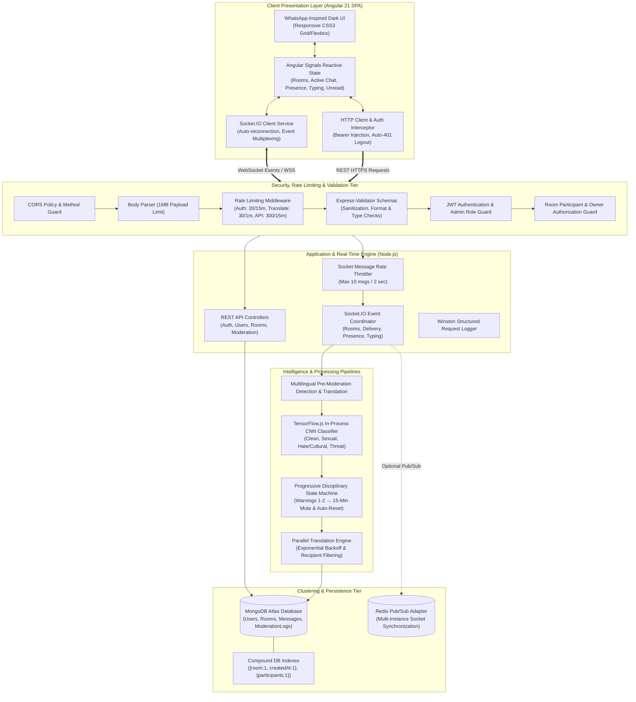
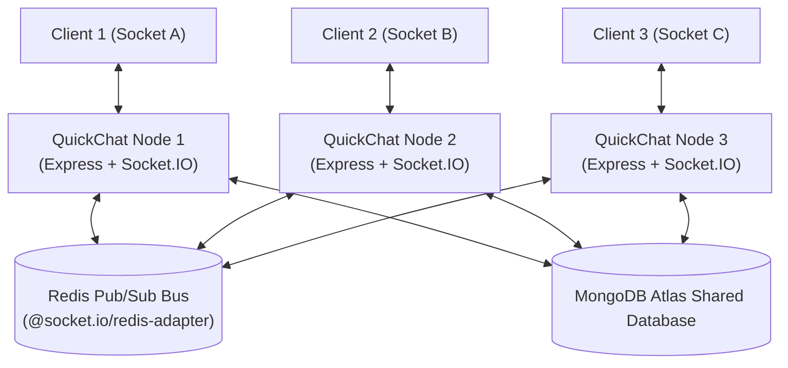
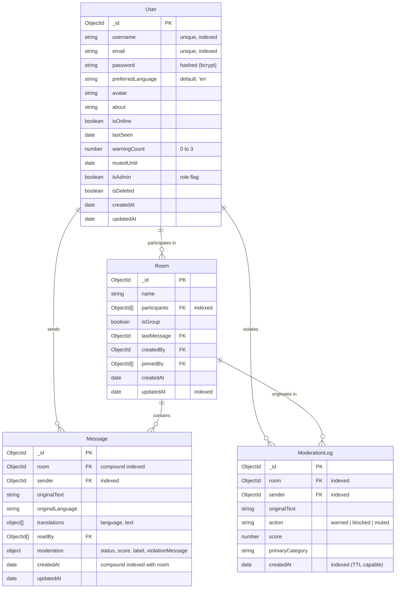

# QuickChat — System Architecture Specification

> **Project**: QuickChat — Multilingual Real-Time Chat Platform with In-Process Edge AI Moderation  
> **Academic Scope**: Major Project / Capstone Engineering Documentation  
> **Version**: 2.0 (Production Hardened)

---

## 1. High-Level System Architecture

QuickChat is architected as a decoupled, full-stack distributed communication system. The system integrates a reactive single-page frontend (Angular 21 Zoneless), an event-driven asynchronous backend (Express + Socket.IO), a local neural inference engine (TensorFlow.js), a resilient translation pipeline, and document persistence (MongoDB with Mongoose).



---

## 2. Layer-by-Layer Architectural Breakdown

### 2.1 Presentation Tier (Client SPA)
- **Framework**: Angular 21 with native Zoneless change detection (`provideZonelessChangeDetection()`), completely removing the runtime monkey-patching overhead of `zone.js`.
- **State Management**: Reactive Angular Signals (`signal`, `computed`, `effect`) ensuring granular, DOM-level rendering without zone sweeps.
- **Component Architecture**:
  - `ChatLayoutComponent`: Root shell orchestrating sidebar navigation, responsive breakpoints, user menu, and modal triggers.
  - `ChatWindowComponent`: Active conversation thread, translation controls, virtual pagination loader, moderation warning banners, and group participant summaries.
  - `RoomListComponent`: Real-time room list with unread count pills, pin indicators, presence status, and group badges.
  - `UserSearchComponent`: Instant user search for starting direct messages.
  - `CreateGroupModalComponent`: Multi-participant selection with live user search, removable chips, custom group naming, and dynamic count badges.
- **Interceptors**: 
  - `auth.interceptor.ts`: Attaches standard `Authorization: Bearer <token>` headers to outgoing REST requests.
  - Automatic `401 Unauthorized` detection and session eviction, preventing frozen states upon token expiration.
- **Real-Time Synchronizer**: `chat.service.ts` coordinates socket lifecycles (`connect`, `disconnect`, `connect_error`, `reconnect`), dynamic room events (`room-created`, `room-updated`), and maintains in-memory unread counts, active room state, and typing statuses.

---

### 2.2 Security & Gateway Tier
The gateway layer implements defense-in-depth across both HTTP and WebSocket transports:

| Component | Responsibility | Implementation |
|:---|:---|:---|
| **CORS Guard** | Origin whitelisting & permitted HTTP methods | `cors()` middleware restricting access to `CLIENT_URL` with explicit HTTP methods (`GET, POST, PUT, PATCH, DELETE, OPTIONS`). |
| **Payload Protection** | Denial of Service mitigation | `express.json({ limit: '1mb' })` preventing memory exhaustion from oversized JSON payloads. |
| **Rate Limiters** | Brute-force & resource abuse defense | `express-rate-limit` tiers: `authLimiter` (20 attempts/15 min), `translateLimiter` (30 reqs/min), and `apiLimiter` (300 reqs/15 min). |
| **Socket Throttler** | Real-time spam prevention | Per-socket rolling window tracker enforcing a ceiling of 10 messages per 2 seconds. |
| **Input Validation** | Schema validation & sanitization | `express-validator` chains enforcing strict types, email normalization, username regex, and message length bounds (max 5,000 chars). |
| **Role Authorization** | Privileged route protection | `adminOnly` middleware verifying `req.user.isAdmin === true` before exposing moderation statistics or audit logs. |
| **IDOR Guard** | Authorization & data tenancy | `roomAuthMiddleware` verifying user membership in `room.participants` and ownership for room mutations. |

---

### 2.3 Edge AI Content Moderation Architecture

Unlike conventional architectures that send sensitive chat conversations to third-party cloud moderation APIs, QuickChat executes content moderation **locally in-process** within the Node.js V8 runtime.

```mermaid
flowchart LR
    InputMsg["Incoming Message Text"] --> AsciiCheck{"Contains Non-ASCII\nOr Non-English?"}
    
    AsciiCheck -- Yes --> TransPass["Translate to English\n(Google GTX Gateway)"]
    AsciiCheck -- No --> Tokenizer["Unicode-Aware Tokenizer\n(Regex Normalization & Vocabulary Encoding)"]
    
    TransPass --> Tokenizer
    
    Tokenizer --> Vector["Integer Sequence Vector\n(Length: 30 Tokens)"]
    Vector --> Embedding["Embedding Layer\n(Input: 690, Dim: 32)"]
    Embedding --> Pooling["Global Average Pooling 1D"]
    Pooling --> Dense["Dense Layer (32 Units, ReLU)"]
    Dense --> Dropout["Dropout Layer (Rate: 0.2)"]
    Dropout --> Softmax["Softmax Output Layer\n(4 Classes)"]
    
    Softmax --> Probs["Probability Distribution\n[clean, sexual, hate_cultural, threat]"]
    
    Probs --> Decision{"Confidence Threshold\nEvaluation"}
    Decision -- "Confidence >= 0.65 (Violation)" --> Blocked["Action: BLOCKED\n(Message Suppressed, Logged)"]
    Decision -- "0.40 <= Confidence < 0.65" --> Warned["Action: WARNED\n(Sanitized/Delivered with Warning)"]
    Decision -- "Clean or Confidence < 0.40" --> Clean["Action: CLEAN\n(Proceeds to Translation)"]
```



#### Neural Network Topology
- **Model Type**: Feedforward Text Classification CNN / Embedding Average Network.
- **Input Dimension**: Sequence length of 30 integer token indices.
- **Embedding Layer**: 690-word vocabulary mapped into a 32-dimensional continuous vector space.
- **Global Average Pooling 1D**: Computes fixed-length output vectors across time steps.
- **Dense Layers**: 32 hidden units with ReLU activation, 20% Dropout regularization, and 4-unit Softmax classification output.
- **Inference Latency**: ~5ms to 12ms per message on standard CPU execution.

---

### 2.4 Multi-Instance Horizontal Scalability (Clustering)

QuickChat is designed to scale horizontally across multiple containerized backend instances using a Redis Pub/Sub backplane.



- **Single-Node Mode (Development)**: When `REDIS_URL` is omitted, the server operates using the high-speed default in-memory Socket.IO adapter.
- **Cluster Mode (Production)**: When `REDIS_URL` is supplied, `@socket.io/redis-adapter` automatically routes socket broadcasts across all server replicas, enabling seamless inter-node message delivery and presence updates.

---

### 2.5 Database Schema & Indexing Architecture



#### Indexing Strategy
1. `Message`: `{ room: 1, createdAt: 1 }` (compound index enabling sub-millisecond cursor pagination and timeline queries).
2. `Message`: `{ sender: 1 }` (user activity & search lookups).
3. `Room`: `{ participants: 1 }` (user conversation discovery).
4. `Room`: `{ updatedAt: -1 }` (sidebar sorting by recent activity).
5. `ModerationLog`: `{ sender: 1, createdAt: -1 }` (admin audit log lookups).

---

## 2.6 Automated Testing & Verification Architecture

QuickChat utilizes Jest for automated backend unit and integration testing, covering 18 test cases across 5 dedicated suites:

```
Server/tests/
├── groupChat.test.js           # Group room creation, custom name, createdBy & Socket.IO broadcast
├── roomAuth.test.js            # IDOR prevention, participant authorization, malformed ObjectId handling
├── messageDelete.test.js       # Message-level deletion, author ownership validation & cascade updates
├── moderation.test.js          # In-process TensorFlow.js inference, confidence boundaries & classification
└── securityValidation.test.js  # Input sanitization, password strength, regex & express-validator chains
```

- **Execution Command**: `npm test` (with `--detectOpenHandles --forceExit`)
- **Frontend Verification**: `npx ng build --configuration=development` ensuring strict TypeScript & Angular template compilation.

