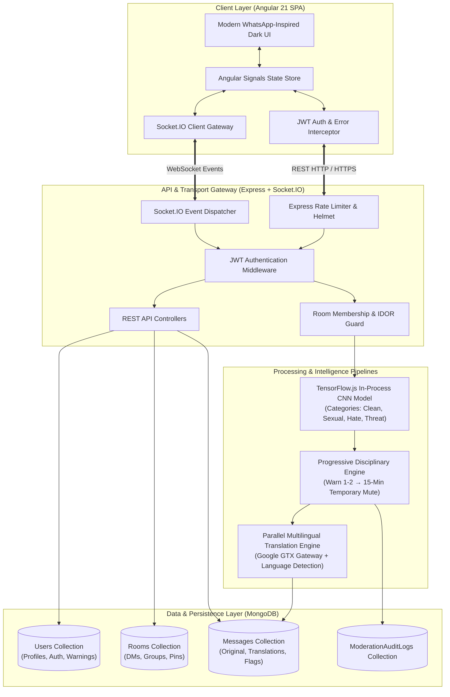
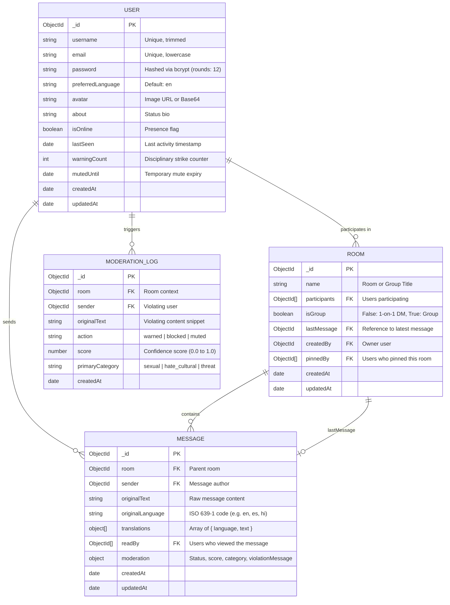
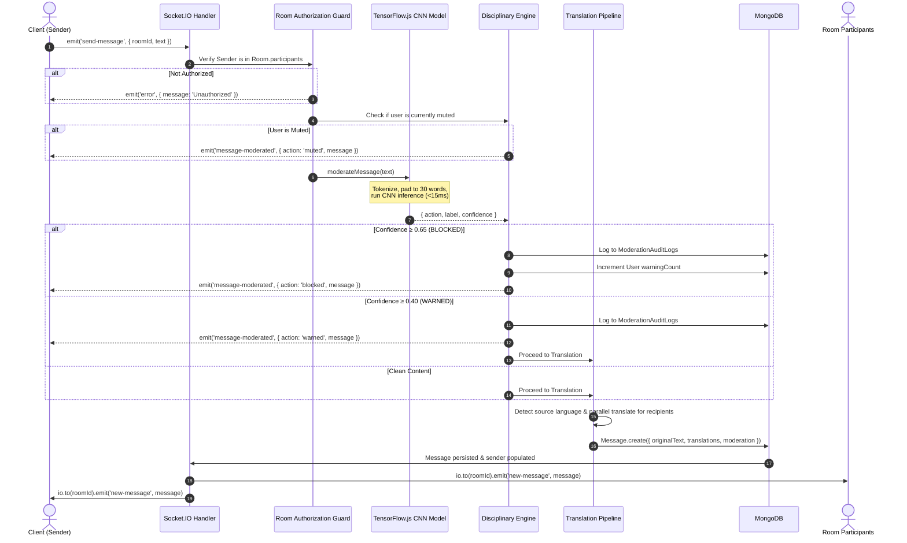

# QuickChat — Multilingual Real-Time Chat with Edge AI Content Moderation

[](https://angular.dev/)
[](https://nodejs.org/)
[](https://socket.io/)
[](https://www.tensorflow.org/js)
[](https://www.mongodb.com/)
[](https://jestjs.io/)
[](#)

> **Major Project (Capstone)**  
> **Domain**: Full-Stack Distributed Systems, Real-Time Web Architecture, Edge NLP / Applied Machine Learning  
> **Repository Type**: Decoupled Monorepo (Client SPA + Node.js Backend Engine)

---

## 1. Executive Summary & Problem Statement

Modern communication platforms connect people across diverse geographical and cultural backgrounds, yet two pervasive barriers persist:
1. **Language Barriers**: Participants speaking different languages often need external translation tools, which disrupt conversational flow and reduce engagement.
2. **Toxicity & Cyber-Harassment**: Unmoderated spaces quickly degrade into hostile environments. Conventional moderation solutions rely on third-party cloud APIs (e.g., Perspective API, OpenAI Moderation) which introduce high network latency, recurring per-token SaaS costs, and privacy vulnerabilities by sending sensitive private chat data to external corporate servers.

### The QuickChat Solution
**QuickChat** is a production-grade, secure, real-time messaging platform engineered to eliminate both barriers:
- **Zero-Latency In-Process AI Moderation**: Uses a local, custom-trained Convolutional Neural Network (CNN) running directly in the Node.js runtime via TensorFlow.js. Inference completes in under 15ms per message with zero cloud API dependencies or per-request costs.
- **Dual-Tier Dynamic Translation**: Automatically detects incoming language and translates messages into each participant's preferred language in real time, supplemented with on-demand per-message toggles and client-side translation caching.
- **Enterprise-Grade Real-Time Engine**: Built on Socket.IO with WebSocket transports, bidirectional heartbeat tracking, multi-device presence synchronization, and true read receipt confirmations.
- **High-Performance Zoneless Frontend**: Built with Angular 21 utilizing native Signals for reactive change detection, entirely eliminating the overhead of `zone.js`.

---

## 2. System Architecture



---

## 3. Technology Stack & Rationale

| Layer | Technology | Version | Engineering Rationale |
|---|---|---|---|
| **Frontend Framework** | Angular | `^21.1.0` | Enterprise-grade component modularity, strict TypeScript compilation, and built-in dependency injection. |
| **Frontend State** | Angular Signals | Built-in | Zoneless change detection (`provideZonelessChangeDetection`), eliminating `zone.js` runtime monkey-patching for maximum rendering performance. |
| **Styling** | Vanilla CSS Tokens | CSS3 Variables | Full aesthetic control, WhatsApp dark mode palette, zero bloated CSS runtime overhead. |
| **Backend Runtime** | Node.js / Express | `LTS / ^4.18` | Non-blocking event-driven asynchronous I/O optimized for handling high-concurrency socket connections. |
| **Real-Time Protocol** | Socket.IO | `^4.6.1` | Automatic WebSocket upgrade, connection fallback, channel/room abstraction, and built-in multiplexing. |
| **Machine Learning** | TensorFlow.js | `^4.22.0` | In-process C++ bindings running directly within the Node.js V8 process. Zero external API latency, zero privacy leaks. |
| **Database** | MongoDB via Mongoose | `^8.0.3` | Document-oriented schema flexibility ideal for nested translations array and dynamic moderation metadata. |
| **Security & Auth** | JWT & BCrypt | `jsonwebtoken ^9.0`, `bcryptjs ^2.4` | Stateless token authentication with salted cryptographic password hashing (salt rounds: 12). |
| **Unit Testing** | Vitest | `^4.0.8` | Modern, lightning-fast ESM-native test runner replacing legacy Karma/Jasmine. |

---

## 4. Database Schema & Data Dictionary



---

## 5. REST API Reference

Base URL: `http://localhost:5001/api`

### Authentication (`/api/auth`)
| Method | Endpoint | Access | Body / Query | Description | Status Codes |
|---|---|---|---|---|---|
| `POST` | `/auth/signup` | Public | `{ username, email, password, preferredLanguage? }` | Registers a new account and returns JWT token. | `201 Created`, `400 Bad Request` |
| `POST` | `/auth/login` | Public | `{ email, password }` | Authenticates credentials and returns JWT token. | `200 OK`, `401 Unauthorized` |
| `GET` | `/auth/me` | Protected | `Header: Bearer <token>` | Returns current authenticated user session. | `200 OK`, `401 Unauthorized` |

### Chat & Messaging (`/api/chat`)
| Method | Endpoint | Access | Body / Query | Description | Status Codes |
|---|---|---|---|---|---|
| `GET` | `/chat/rooms` | Protected | `Header: Bearer <token>` | Retrieves user's active rooms (pinned chats sorted first). | `200 OK`, `401 Unauthorized` |
| `POST` | `/chat/rooms` | Protected | `{ participantIds: string[], name?: string, isGroup?: boolean }` | Creates a new DM or Group room with custom name & broadcast. | `201 Created`, `400 Bad Request` |
| `GET` | `/chat/rooms/:roomId/messages` | Protected (Member) | `?before=<date>&limit=50` | Cursor-paginated message retrieval for authorized rooms. | `200 OK`, `403 Forbidden` |
| `DELETE` | `/chat/messages/:messageId` | Protected (Author) | `Header: Bearer <token>` | Deletes an individual message sent by the user. | `200 OK`, `403 Forbidden` |
| `POST` | `/chat/rooms/:roomId/pin` | Protected (Member) | `Header: Bearer <token>` | Toggles pin state for the authenticated user. | `200 OK`, `403 Forbidden` |
| `DELETE` | `/chat/rooms/:roomId/messages` | Protected (Member) | `Header: Bearer <token>` | Clears chat message history within the room. | `200 OK`, `403 Forbidden` |
| `DELETE` | `/chat/rooms/:roomId` | Protected (Member) | `Header: Bearer <token>` | Deletes room and associated messages. | `200 OK`, `403 Forbidden` |
| `GET` | `/chat/users/search` | Protected | `?q=searchQuery` | Searches users by username or email for new chats. | `200 OK` |
| `GET` | `/chat/languages` | Protected | `Header: Bearer <token>` | Returns list of supported translation languages. | `200 OK` |
| `POST` | `/chat/translate` | Protected | `{ text, targetLanguage, sourceLanguage? }` | Performs on-demand translation of a message. | `200 OK`, `400 Bad Request` |

### User Profile (`/api/users`)
| Method | Endpoint | Access | Body / Query | Description | Status Codes |
|---|---|---|---|---|---|
| `GET` | `/users/me` | Protected | `Header: Bearer <token>` | Returns full profile information. | `200 OK`, `401 Unauthorized` |
| `PUT` | `/users/me` | Protected | `{ username?, email?, about?, preferredLanguage?, avatar? }` | Updates profile fields with duplicate validation. | `200 OK`, `400 Bad Request` |
| `PUT` | `/users/me/password` | Protected | `{ currentPassword, newPassword }` | Updates password after verifying current password. | `200 OK`, `400 Bad Request` |
| `DELETE` | `/users/me` | Protected | `Header: Bearer <token>` | Soft-deletes user account without corrupting chat threads. | `200 OK` |

### Moderation & Analytics (`/api/moderation`)
| Method | Endpoint | Access | Body / Query | Description | Status Codes |
|---|---|---|---|---|---|
| `GET` | `/moderation/stats` | Protected | `Header: Bearer <token>` | Returns aggregate moderation metrics and breakdown. | `200 OK` |
| `GET` | `/moderation/logs` | Protected (Admin) | `?page=1&limit=20` | Returns paginated audit logs of flagged content. | `200 OK`, `403 Forbidden` |

---

## 6. Socket.IO Real-Time Protocol

Clients establish a WebSocket connection to `http://localhost:5001` passing the JWT token in the handshake payload:
```javascript
const socket = io('http://localhost:5001', {
  auth: { token: '<JWT_TOKEN>' }
});
```

### Event Specification Matrix

| Event Name | Direction | Payload | Description |
|---|---|---|---|
| `join-room` | Client $\rightarrow$ Server | `roomId: string` | Client enters a chat room channel (membership verified). |
| `leave-room` | Client $\rightarrow$ Server | `roomId: string` | Client exits a chat room channel. |
| `send-message` | Client $\rightarrow$ Server | `{ roomId: string, text: string }` | Sends message into the AI moderation and translation pipeline. |
| `delete-message` | Client $\rightarrow$ Server | `{ messageId: string, roomId: string }` | Broadcasts deletion of a specific message across the room. |
| `typing` | Client $\rightarrow$ Server | `{ roomId: string, isTyping: boolean }` | Broadcasts typing state to other participants. |
| `mark-read` | Client $\rightarrow$ Server | `{ roomId: string }` | Marks all unread messages in the room as read by user. |
| `new-message` | Server $\rightarrow$ Client | `Message` (populated) | Broadcasts newly delivered, moderated message. |
| `message-deleted` | Server $\rightarrow$ Client | `{ messageId, roomId }` | Real-time removal of deleted message from participant views. |
| `room-created` | Server $\rightarrow$ Client | `Room` (populated) | Real-time broadcast on `user:<id>` channel adding new group to sidebar. |
| `room-updated` | Server $\rightarrow$ Client | `{ roomId, lastMessage }` | Real-time update emitted to participants' personal channels for sidebar previews. |
| `user-typing` | Server $\rightarrow$ Client | `{ userId, username, isTyping }` | Notifies recipients of active typing activity. |
| `messages-read` | Server $\rightarrow$ Client | `{ roomId, userId, readAt }` | Triggers double-blue ticks on sender's active interface. |
| `message-moderated` | Server $\rightarrow$ Client | `{ action, message, warningCount?, maxWarnings? }` | Private warning/block alert sent only to offending sender. |
| `user-online` | Server $\rightarrow$ Client | `{ userId }` | Global presence broadcast when a user connects. |
| `user-offline` | Server $\rightarrow$ Client | `{ userId, lastSeen }` | Global presence broadcast when a user disconnects. |

---

## 7. AI Content Moderation & Disciplinary Pipeline

Every message transmitted over the real-time gateway undergoes deterministic moderation **before** database persistence or broadcast:



### Disciplinary Escalation Matrix
- **Strike 1 & 2 (Warning)**: Content is evaluated. If severity falls within the warning boundary ($0.40 \le \text{confidence} < 0.65$), the message is delivered with a cautionary flag, and a visual progress banner appears on the sender's client.
- **Strike 3 (Temporary Mute)**: If a user accumulates 3 infractions or triggers a direct block threshold ($\text{confidence} \ge 0.65$), a 15-minute mute timer is applied. All subsequent message emissions are rejected at the gateway level until the cooldown window expires.

---

## 8. Directory Structure

```
Chatting app/
├── Client/                             # Angular 21 Zoneless SPA
│   ├── src/
│   │   ├── environments/               # Centralized Environment Configurations
│   │   │   ├── environment.ts          # Development API & Socket URLs
│   │   │   └── environment.prod.ts     # Production API & Socket URLs
│   │   ├── app/
│   │   │   ├── auth/                   # Authentication (Login / Signup)
│   │   │   ├── chat/
│   │   │   │   ├── chat-layout/        # Chat shell (sidebar + main viewport + modal trigger)
│   │   │   │   ├── chat-window/        # Thread bubbles, translation bar, moderation banners
│   │   │   │   ├── create-group-modal/ # Interactive group creation modal
│   │   │   │   ├── room-list/          # Left conversation list, pinned items, unread badges
│   │   │   │   └── user-search/        # User discovery modal
│   │   │   ├── landing/                # Public animated product showcase
│   │   │   ├── profile/                # User profile editor & language selector
│   │   │   ├── settings/               # Password management & account deletion
│   │   │   ├── guards/                 # Angular Route Guards (AuthGuard)
│   │   │   ├── interceptors/           # HTTP Interceptor (JWT injection & 401 auto-logout)
│   │   │   └── services/               # Angular Signals Services (Auth, Chat, Translation, User)
│   │   ├── styles.css                  # Design system tokens (WhatsApp Dark Theme)
│   │   └── main.ts                     # Application bootstrap with zoneless change detection
│   └── package.json
│
├── Server/                             # Node.js + Express + Socket.IO Backend
│   ├── ai-model/
│   │   ├── train.js                    # TensorFlow.js CNN model trainer (JS runtime)
│   │   ├── train_python.py             # Optional Python / Keras training alternative
│   │   ├── training-data/              # Labeled datasets (dataset.json, dataset_augmented.json)
│   │   └── trained-model/              # model.json + binary weight shards + config.json
│   ├── controllers/                    # Business logic controllers (Auth, Chat, User, Moderation)
│   ├── middleware/
│   │   ├── authMiddleware.js           # JWT verification & adminOnly role authorization
│   │   ├── roomAuthMiddleware.js       # IDOR prevention & room membership authorization
│   │   ├── validationMiddleware.js     # express-validator schemas & sanitizer chains
│   │   └── rateLimiter.js              # Multi-tier express-rate-limit protection
│   ├── models/                         # Mongoose Schemas with compound indexes (User, Room, Message, ModerationLog)
│   ├── routes/                         # Express Route Definitions
│   ├── services/
│   │   ├── contentModerationService.js # Multilingual pre-moderation + TensorFlow.js inference
│   │   └── translationService.js       # Parallel Google GTX translation with exponential backoff retry
│   ├── socket/
│   │   └── socketHandler.js            # Real-time WebSocket event listeners, presence & socket throttler
│   ├── tests/                          # 18 Automated Jest Unit Tests (5 suites)
│   │   ├── groupChat.test.js
│   │   ├── roomAuth.test.js
│   │   ├── messageDelete.test.js
│   │   ├── moderation.test.js
│   │   └── securityValidation.test.js
│   ├── utils/
│   │   └── logger.js                   # Winston structured logger & HTTP requestLogger middleware
│   ├── .env.example                    # Clean environment configuration template
│   ├── server.js                       # HTTP server, Socket.IO & optional Redis adapter setup
│   └── package.json
│
├── ARCHITECTURE.md                     # Comprehensive System Architecture & Topology
├── WORKFLOWS.md                        # End-to-End Sequence & State Machine Workflows
├── PROJECT_STATUS.md                   # Completed Capabilities Matrix & Future Scope
├── GAPS_AND_BLOCKERS.md                # 22-Point Security & Quality Audit Checklist (Resolved)
├── docker-compose.yml                  # Production multi-container orchestrator
└── README.md                           # Master Project Documentation
```

---

## 9. Local Setup & Execution Guide

### Prerequisites
- **Node.js**: v18.0.0 or higher
- **npm**: v9.0.0 or higher
- **MongoDB**: Local `mongod` instance or MongoDB Atlas connection URI

### Step 1: Clone and Configure Environment Variables
Create `/Server/.env`:
```env
PORT=5001
MONGO_URI=mongodb://localhost:27017/bilingual-chat
JWT_SECRET=your_super_secure_jwt_secret_key_2026
JWT_EXPIRES_IN=7d
CLIENT_URL=http://localhost:4200
```

### Step 2: Install Dependencies & Verify AI Model
```bash
# Install Server dependencies
cd Server
npm install

# Verify or Retrain AI Moderation Model (Optional — model files pre-exist in trained-model/)
node ai-model/train.js

# Install Client dependencies
cd ../Client
npm install
```

### Step 3: Run the Application
In Terminal 1 (Start Backend Engine):
```bash
cd Server
npm run dev
# Server running on http://localhost:5001
```

In Terminal 2 (Start Frontend SPA):
```bash
cd Client
npm start
# Client running on http://localhost:4200
```

---

## 10. Key Evaluation & Viva Presentation Highlights

### 1. How is In-Process AI Moderation Superior to Cloud APIs?
Conventional applications invoke external REST endpoints (e.g. AWS Comprehend, Perspective API) on every chat message. This introduces an average network latency of 200–500ms, incurs monetary cost per message, and breaches user privacy. QuickChat loads a compiled TensorFlow.js CNN topology directly into Node.js heap memory, computing inference in **under 15ms** without data ever leaving the host server.

### 2. How is Insecure Direct Object Reference (IDOR) Mitigated?
In distributed chat architectures, passing an arbitrary `roomId` to fetch or delete messages is a critical vulnerability. QuickChat enforces strict membership authorization via `roomAuthMiddleware`: every database query verifies that the requesting user's identity (`req.user.id`) exists within `room.participants`. Non-members receive immediate `403 Forbidden` responses.

### 3. Why Angular 21 Zoneless over Traditional Frameworks?
Traditional Angular relied on `zone.js` to monkey-patch all browser asynchronous APIs (events, timers, promises) to trigger top-down dirty checking across the entire component tree. QuickChat utilizes Angular 21's zoneless change detection (`provideZonelessChangeDetection`) paired with **Angular Signals**. Updates trigger fine-grained, localized DOM mutations only where data has explicitly changed, drastically cutting CPU overhead.
