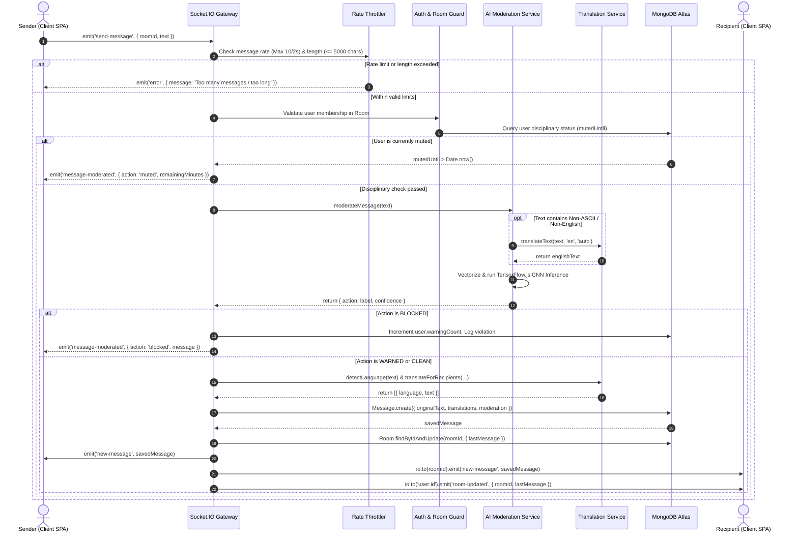
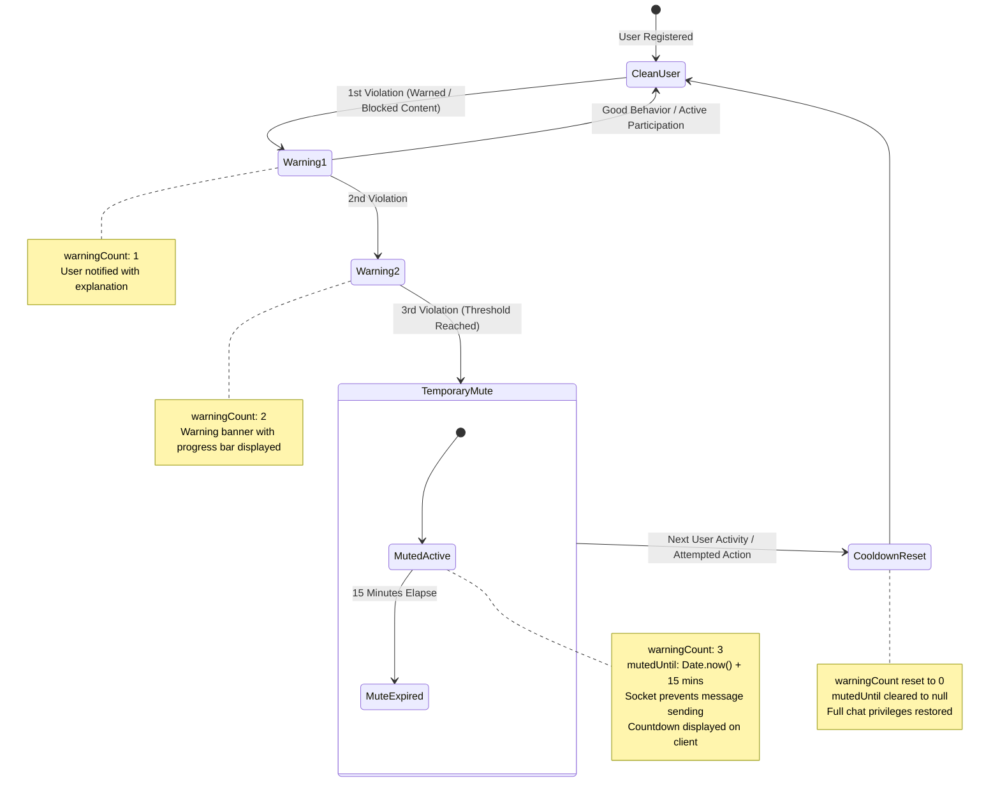
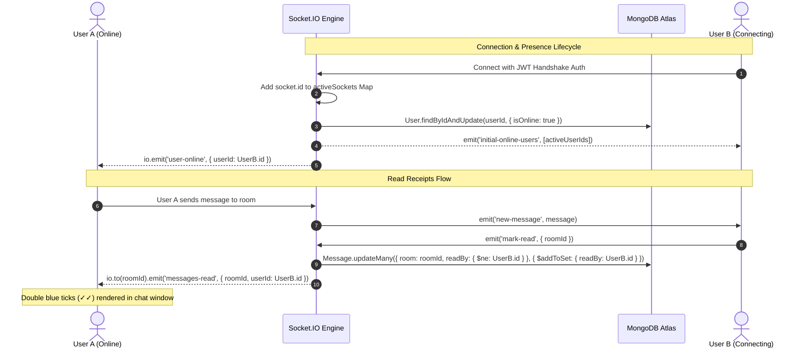
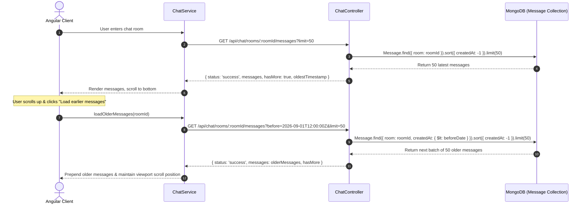
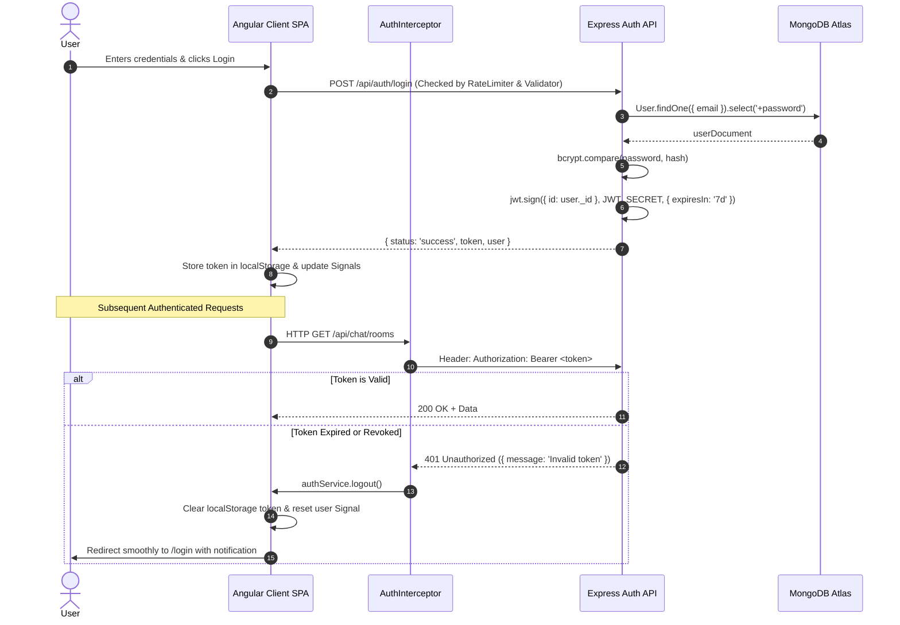
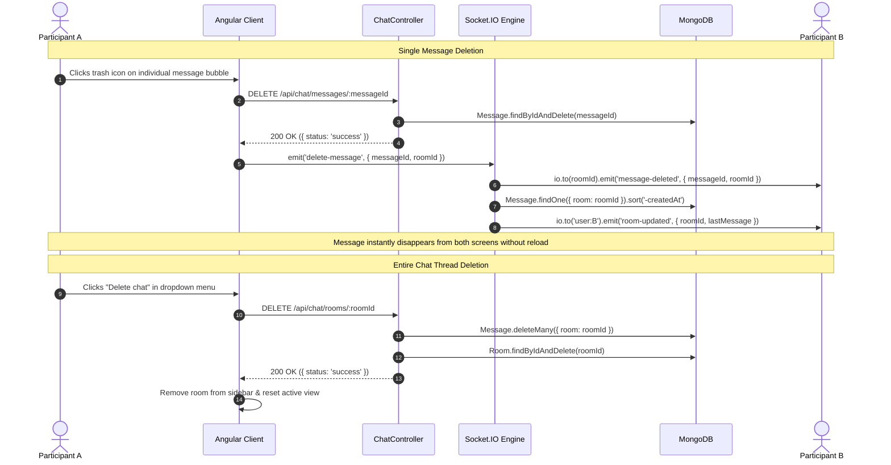
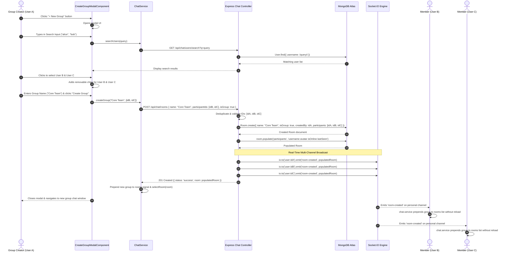

# QuickChat — System Workflows & Sequence Specifications

> **Project**: QuickChat — Multilingual Real-Time Chat Platform with In-Process Edge AI Moderation  
> **Academic Scope**: Major Project / Capstone Engineering Documentation  
> **Version**: 2.0 (Production Hardened)

---

## 1. Message Transmission & Moderation Lifecycle

This sequence illustrates the end-to-end processing of an outgoing chat message, from client dispatch through rate limiting, mute verification, multilingual translation pre-pass, AI neural inference, recipient-targeted translation, database persistence, and real-time WebSocket delivery.

---

## 2. Progressive Disciplinary State Machine

QuickChat implements an automated progressive discipline system for content safety. Violations increment warning counts; reaching the threshold triggers a temporary 15-minute mute. Once the mute elapses, the system automatically cools down and resets disciplinary records.

---

## 3. Real-Time Read Receipts & Presence Tracking

---

## 4. Cursor-Based Message Pagination

To preserve performance and support rooms with thousands of historical messages, QuickChat implements timestamp-based cursor pagination.

---

## 5. User Authentication & 401 Session Eviction

---

## 6. Single Message & Entire Chat Deletion Lifecycle

---

## 7. Group Creation & Multi-User Real-Time Synchronization

This sequence details the interactive group creation process, participant selection, backend room initialization, and real-time Socket.IO fanout to all member dashboards.

